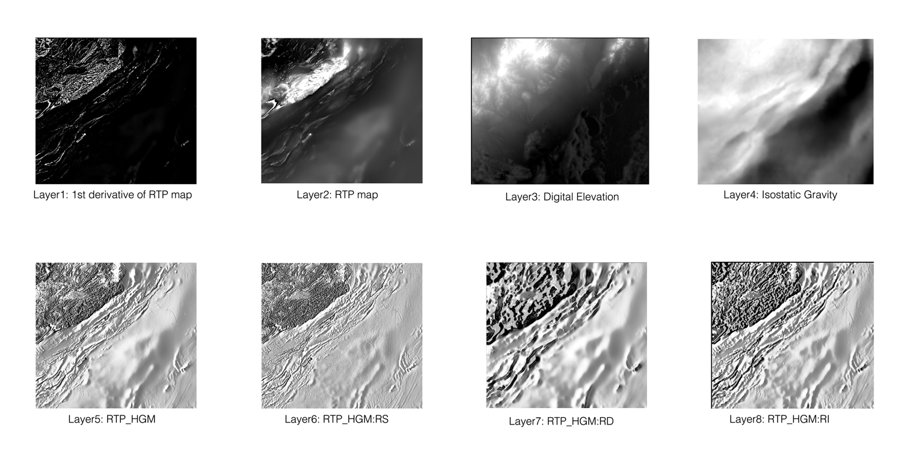
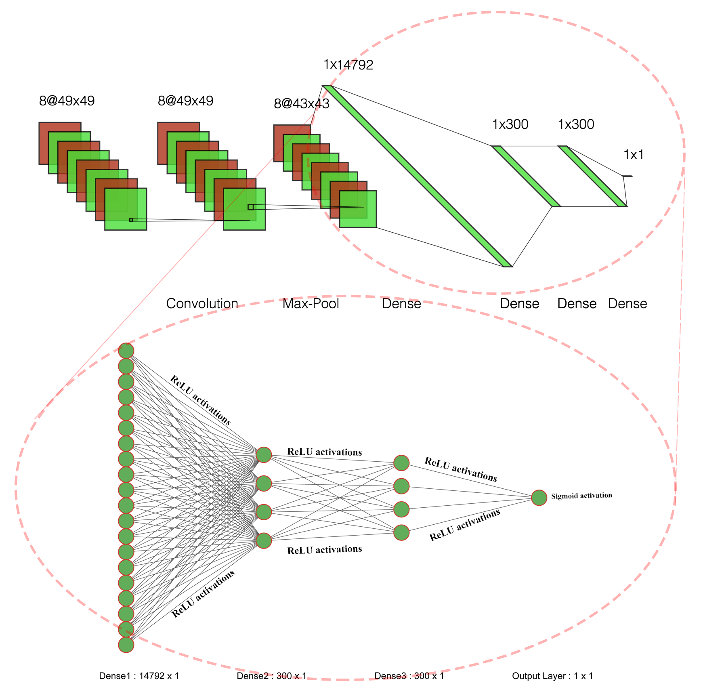
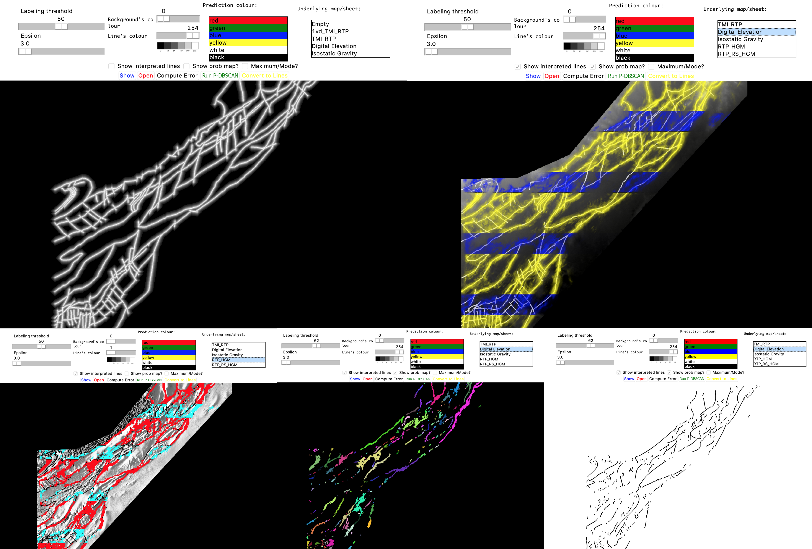

# LineamentLearning

[](https://www.python.org/downloads/)
[](https://www.tensorflow.org/)
[](LICENSE)

> **Deep Learning for Lineament Detection in Geoscience Data**

Minerals exploration is becoming more difficult, particularly because most mineral deposits at the surface of the earth have been found. While there may be a lot of sensing data, there is a shortage of expertise to interpret that data. This thesis aims to bring some of the recent advances in AI to the interpretation of sensing data. Our AI model learns one-dimensional features (lineaments) from two-dimensional data (in particular, magnetics surveys, maps of gravity and digital elevation maps), which surprisingly has not had a great deal of attention (whereas getting two-dimensional or zero-dimensional features is very common). We define a convolutional neural network to predict the probability that a lineament passes through each location on the map. Then, using these probabilities, cluster analysis, and regression models, we develop a post-processing method to predict lineaments. We train and evaluate our model on large real-world datasets in BC and Australia.

## 🎯 Version 2.0 - What's New

This modernized version includes significant improvements:

- **Modern TensorFlow 2.x/Keras**: Updated from legacy Keras to TensorFlow 2.x
- **Multiple Architectures**: Support for RotateNet, U-Net, and ResNet architectures
- **CLI Interface**: User-friendly command-line tools for training and inference
- **Configuration System**: JSON-based configuration management
- **Advanced Training**: Mixed precision, early stopping, TensorBoard integration
- **Better Documentation**: Comprehensive guides and examples
- **Type Hints**: Full type annotations for better code quality
- **Modular Design**: Clean separation of concerns and reusable components

## 📋 Table of Contents

- [Features](#features)
- [Installation](#installation)
- [Quick Start](#quick-start)
- [Architecture](#architecture)
- [Usage](#usage)
- [Configuration](#configuration)
- [Examples](#examples)
- [Contributing](#contributing)
- [Citation](#citation)
- [License](#license)

## ✨ Features

### Core Capabilities
- **Multiple Model Architectures**: RotateNet (original), U-Net, ResNet
- **Advanced Training**: Batch normalization, dropout, early stopping
- **Data Augmentation**: Rotation, flipping, and more
- **Mixed Precision Training**: Faster training on modern GPUs
- **TensorBoard Integration**: Real-time training visualization
- **Flexible Configuration**: JSON/YAML configuration files
- **CLI Tools**: Easy command-line interface for all operations

### Input Data Support
- Magnetic surveys
- Gravity maps
- Digital elevation models (DEM)
- Multiple geophysical layers (up to 8 layers)
- **Multiple file formats**: .mat (MATLAB), .npz (NumPy), .h5 (HDF5)

### Data Format Conversion
- Convert MATLAB .mat files to PyData formats (NumPy, HDF5, Zarr)
- Improved performance and interoperability
- Memory-efficient chunked loading for large datasets
- Built-in conversion tools and utilities

See [MAT_TO_PYDATA_GUIDE.md](MAT_TO_PYDATA_GUIDE.md) for data conversion documentation.

### Post-Processing
- DBSCAN clustering
- Line/curve fitting (linear, polynomial)
- Probability map generation
- Visualization tools
- Comprehensive statistics

See [POSTPROCESSING_GUIDE.md](POSTPROCESSING_GUIDE.md) for detailed documentation.

## 🚀 Installation

### Prerequisites
- Python 3.8 or higher
- CUDA 11.2+ (optional, for GPU support)
- 8GB+ RAM recommended

### Option 1: Install from Source (Recommended)

```bash
# Clone the repository
git clone https://github.com/RichardScottOZ/LineamentLearning.git
cd LineamentLearning

# Create virtual environment (recommended)
python -m venv venv
source venv/bin/activate  # On Windows: venv\Scripts\activate

# Install in development mode
pip install -e .

# Or install with all features
pip install -e ".[full,modern-ui,dev]"
```

### Option 2: Install from PyPI (Coming Soon)

```bash
pip install lineament-learning
```

### Verify Installation

```bash
python -c "import tensorflow as tf; print('TensorFlow version:', tf.__version__)"
lineament-train --help
```

## 🎮 Quick Start

### Converting Data (Optional but Recommended)

For better performance, convert MATLAB .mat files to HDF5 format:

```bash
# Inspect your .mat file
python -m mat_converter --inspect ./Dataset/Australia/Rotations/Australia_strip.mat

# Convert to HDF5 (faster loading, better compression)
python -m mat_converter \
    ./Dataset/Australia/Rotations/Australia_strip.mat \
    ./Dataset/Australia_strip.h5 \
    --format hdf5

# Validate conversion
python -m mat_converter --validate \
    ./Dataset/Australia/Rotations/Australia_strip.mat \
    ./Dataset/Australia_strip.h5
```

See [MAT_TO_PYDATA_GUIDE.md](MAT_TO_PYDATA_GUIDE.md) for comprehensive conversion documentation.

### Training a Model

```bash
# Train with default RotateNet architecture (using .mat file)
lineament-train \
    --data ./Dataset/Australia/Rotations/Australia_strip.mat \
    --output ./models/my_model \
    --epochs 50 \
    --tensorboard

# Train with converted HDF5 file (faster)
lineament-train \
    --data ./Dataset/Australia_strip.h5 \
    --format hdf5 \
    --output ./models/my_model \
    --epochs 50 \
    --tensorboard

# Train with U-Net architecture
lineament-train \
    --data ./Dataset/Australia/Rotations/Australia_strip.mat \
    --output ./models/unet_model \
    --architecture UNet \
    --window-size 64 \
    --epochs 100
```

### Running Inference

```bash
# Run prediction
lineament-predict \
    --model ./models/my_model/best_model.h5 \
    --data ./Dataset/test_data.mat \
    --output ./results \
    --visualize \
    --threshold 0.5
```

### Using Python API

```python
from config import Config
from model_modern import build_model, ModelTrainer

# Create configuration
config = Config()
config.model.architecture = 'UNet'
config.model.window_size = 64
config.model.epochs = 100

# Build and train model
model = build_model(config)
trainer = ModelTrainer(config, output_dir='./models')

# Model summary
model.summary()
```

## 🏗️ Architecture

### Input Layers
We use 8 aerial/geophysical images to train this model: 



### Supported Model Architectures

#### 1. RotateNet (Original)
The original architecture from the thesis with modern improvements:
- Convolutional layer (3×3 kernel, 8 filters)
- Max pooling (6×6)
- Two dense layers (300 units each)
- Sigmoid output for binary classification



#### 2. U-Net
U-Net architecture adapted for lineament detection:
- Encoder-decoder structure with skip connections
- Better spatial context preservation
- Excellent for segmentation tasks

#### 3. ResNet
ResNet-inspired architecture:
- Skip connections for deeper networks
- Batch normalization
- Residual blocks for better gradient flow

### Training Pipeline

```
Input Data → Preprocessing → Data Augmentation → Model Training → 
→ Validation → Checkpoint Saving → Probability Maps → 
→ Post-processing (Clustering + Line Fitting) → Final Lineaments
```

## 📖 Usage

### Configuration File

Create a `config.json` file:

```json
{
    "model": {
        "architecture": "UNet",
        "window_size": 64,
        "batch_size": 32,
        "epochs": 100,
        "learning_rate": 0.001,
        "use_batch_normalization": true,
        "use_dropout": true,
        "dropout_rate": 0.3
    },
    "data": {
        "mask_threshold": 0.9,
        "train_ratio": 0.7,
        "val_ratio": 0.15,
        "test_ratio": 0.15
    },
    "inference": {
        "threshold": 0.5,
        "clustering_method": "DBSCAN",
        "line_fitting_method": "BestCurve"
    }
}
```

Use with CLI:

```bash
lineament-train --config config.json --data ./data/train.mat --output ./models
```

### Python API Examples

#### Training with Custom Configuration

```python
from config import Config
from model_modern import ModelTrainer

# Load or create config
config = Config.from_file('config.json')

# Initialize trainer
trainer = ModelTrainer(config, output_dir='./models')

# Train model
trainer.train(
    data_path='./data/train.mat',
    use_tensorboard=True
)
```

#### Custom Model Architecture

```python
from tensorflow import keras
from config import Config

def create_custom_model(config):
    inputs = keras.layers.Input(
        shape=(config.model.window_size, config.model.window_size, 8)
    )
    
    # Your custom architecture here
    x = keras.layers.Conv2D(32, 3, activation='relu')(inputs)
    # ... more layers ...
    
    outputs = keras.layers.Dense(1, activation='sigmoid')(x)
    model = keras.Model(inputs, outputs)
    return model
```

## ⚙️ Configuration

### Model Configuration Options

| Parameter | Type | Default | Description |
|-----------|------|---------|-------------|
| `architecture` | str | "RotateNet" | Model architecture (RotateNet, UNet, ResNet) |
| `window_size` | int | 45 | Input patch size |
| `batch_size` | int | 32 | Training batch size |
| `epochs` | int | 150 | Number of training epochs |
| `learning_rate` | float | 0.001 | Initial learning rate |
| `use_batch_normalization` | bool | true | Enable batch normalization |
| `use_dropout` | bool | true | Enable dropout regularization |
| `dropout_rate` | float | 0.3 | Dropout rate (0-1) |
| `use_mixed_precision` | bool | false | Enable mixed precision training |
| `use_early_stopping` | bool | true | Enable early stopping |

### Data Configuration Options

| Parameter | Type | Default | Description |
|-----------|------|---------|-------------|
| `train_ratio` | float | 0.7 | Training data ratio |
| `val_ratio` | float | 0.15 | Validation data ratio |
| `test_ratio` | float | 0.15 | Test data ratio |
| `normalize_inputs` | bool | true | Normalize input data |

## 📊 Examples

### Example Notebooks

Check the `examples/` directory for Jupyter notebooks:
- `01_data_exploration.ipynb` - Explore and visualize data
- `02_model_training.ipynb` - Train models step-by-step
- `03_inference_visualization.ipynb` - Run inference and visualize results
- `04_custom_architecture.ipynb` - Create custom architectures

### Legacy GUI Applet

The original TKinter-based GUI is still available:

```python
from Demo import *
# Runs the legacy applet
```



## 🔗 Integration with Original Pipeline

The modernization maintains **100% backward compatibility** while providing integration bridges.

### Original Components Still Work

All original files are preserved and functional:
- **MODEL.py**: Original RotateNet architecture
- **DATASET.py**: Data loading from .mat files
- **FILTER.py**: Rotation filters
- **Prob2Line.py**: Original clustering & line fitting
- **PmapViewer.py**: GUI applet
- **RotateLearning.py**: Original training workflows
- **Utility.py**: Helper functions

### Integration Bridge

The `bridge.py` module connects original and modern components:

```python
from bridge import DatasetAdapter, LegacyTrainer
from config import Config

# Use original data loading with modern models
config = Config()
config.model.architecture = 'UNet'  # Modern architecture!

trainer = LegacyTrainer(config, 'path/to/data.mat')
history = trainer.train_simple(ratio=0.1, epochs=10)
```

### Pipeline Coverage

- ✅ **Model architectures**: Enhanced (3 architectures vs 1)
- ✅ **Post-processing**: Enhanced (BestCurve + visualization)
- ✅ **Configuration**: Modernized (JSON vs global vars)
- ✅ **CLI**: Enhanced (5 commands vs basic argparse)
- ⚠️ **Data loading**: Available but needs integration for modern training
- ⚠️ **Rotation filters**: Available but not integrated with modern pipeline

**📖 Documentation**:
- [PIPELINE_COVERAGE.md](PIPELINE_COVERAGE.md) - Detailed comparison of original vs modern features
- [DATA_LOADING_ROTATION_IMPROVEMENTS.md](DATA_LOADING_ROTATION_IMPROVEMENTS.md) - Specification for data loading and rotation improvements
- [bridge.py](bridge.py) - Integration examples between original and modern components

## 🤝 Contributing

Contributions are welcome! Please feel free to submit a Pull Request.

### Development Setup

```bash
# Install development dependencies
pip install -e ".[dev]"

# Run tests
pytest tests/

# Format code
black .

# Type checking
mypy .
```

## 📚 Citation

If you use this code in your research, please cite the original thesis:

```bibtex
@mastersthesis{aghaee2018lineament,
  title={Deep Learning for Lineament Detection in Geoscience Data},
  author={Aghaee, Amin},
  year={2018},
  school={University of British Columbia},
  url={http://hdl.handle.net/2429/68438}
}
```

## 📄 License

This project is licensed under the MIT License - see the LICENSE file for details.

## 👥 Authors & Acknowledgments

### Original Author
* [**Amin Aghaee**](https://github.com/aminrd/) - Original research and implementation

### Modernization Contributors
* Version 2.0 modernization and improvements

### References
* Original thesis: [Deep Learning for Lineament Detection](http://hdl.handle.net/2429/68438)

## 🔮 Future Work & Roadmap

### Planned Improvements
- [ ] **Advanced Architectures**: Attention mechanisms, Transformers
- [ ] **Multi-scale Processing**: Pyramid networks for multi-resolution analysis
- [ ] **3D Support**: Extension to 3D geophysical data
- [ ] **Active Learning**: Interactive labeling and model improvement
- [ ] **Cloud Deployment**: Docker, Kubernetes, cloud platforms
- [ ] **Mobile Deployment**: TensorFlow Lite for mobile devices
- [ ] **Explainability**: GradCAM, attention visualization
- [ ] **Ensemble Methods**: Model ensembling for better predictions
- [ ] **Real-time Processing**: Streaming data support
- [ ] **Web Dashboard**: Modern React/Vue.js dashboard
- [ ] **API Server**: RESTful API for model serving
- [ ] **Automated Hyperparameter Tuning**: Optuna/Ray Tune integration

### Technology Considerations (2026)
- **Vision Transformers (ViT)**: For better long-range dependencies
- **Diffusion Models**: For data augmentation and generation
- **Foundation Models**: Leveraging pre-trained geoscience models
- **Federated Learning**: Privacy-preserving distributed training
- **Neural Architecture Search**: Automated architecture optimization
- **Quantum ML**: Exploring quantum computing for geoscience

## 📞 Support

- **Issues**: [GitHub Issues](https://github.com/RichardScottOZ/LineamentLearning/issues)
- **Discussions**: [GitHub Discussions](https://github.com/RichardScottOZ/LineamentLearning/discussions)
- **Email**: Create an issue for direct support

## 🔗 Related Resources

- [Original Thesis](http://hdl.handle.net/2429/68438)
- [TensorFlow Documentation](https://www.tensorflow.org/)
- [Keras Documentation](https://keras.io/)
- [Deep Learning for Geoscience](https://github.com/seg)

---

**Note**: This is version 2.0 with significant modernization. For the original legacy version, see the `legacy` branch.
